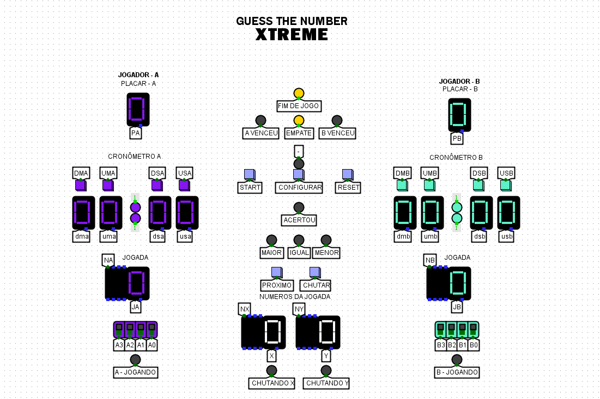
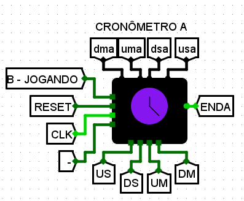

<h1 align="center"> <strong>GUESS THE NUMBER XTREME</strong> </h1>

O projeto trata-se de um jogo de adivinhação contruído inteiramente no Logisim como método de avaliação para a cadeira de Circuitos Digitais 2023.1 da UFCA

  <a href="#-sobre">Sobre</a>&nbsp;&nbsp;&nbsp;|&nbsp;&nbsp;&nbsp;
  <a href="#-circuito">Circuito</a>&nbsp;&nbsp;&nbsp;|&nbsp;&nbsp;&nbsp;
  <a href="#-tecnologias">Tecnologias</a>&nbsp;&nbsp;&nbsp;

 

  

## 📝 Sobre

O projeto trata-se de um jogo de adivinhação em que dois jogadores A e B competem entre si para acertar a maior quantidade de números possível em um determinado tempo. 

Os números que os jogadores buscam acertar são chamados de números ocultos e são a combinação, soma, entre duas coordenadas x e y, tal que cada coordenada é associada a um número de 4bits digitado pelo jogador. 

Além disso, o jogo fornece informações sobre a combinação digitada, ou seja, ela informa se o resultado foi maior, menor ou igual ao número oculto, e, caso a combinação seja igual ao número oculto, o jogador ganha 1 ponto. 

Como já citado, existe um tempo limitado para adivinhar os números ocultos. Para isso, existem um cronômetro para cada jogador, podendo ser configurados pelos próprios jogadores, em que eles deverão ter o mesmo tempo.

O jogo finaliza em duas ocasiões, uma delas é quando o cronômetro de ambos os jogadores zeram e ganha aquele que acumulou mais pontos. A outra ocasião ocorre quando algum jogador, A ou B, acumular 15 pontos primeiro, após isso o jogo é encerrado.

## ⚙️ Circuito

<strong>Circuito do Cronômetro</strong>

  

<strong>Entradas</strong>

<ul>
    <li>Enable: Habilita o circuito inteiro, ou seja, ele que permite as outras funções funcionarem.</li>
    <li>Clear: Zera o cronômetro.</li>
    <li>Clk: O clock do circuito.</li>
    <li>Mode: Altera entre os dois modos possíveis, configuração do cronômetro e exibição do cronômetro.</li>
    <li>US: Muda as unidades dos segundos.</li>
    <li>DS: Muda as dezenas dos segundos.</li>
    <li>UM: Muda as unidades dos minutos.</li>
    <li>DM: Muda as dezenas dos minutos.</li>
</ul>

<strong>Saídas</strong>

<ul>
    <li>USX: Mostra as unidades dos segundos do jogador X.</li>
    <li>DSX: Mostra as dezenas dos segundos do jogador X.</li>
    <li>UMX: Mostra as unidades dos minutos do jogador X.</li>
    <li>DMX: Mostra as dezenas dos minutos do jogador X.</li>
    <li>END: Mostra que o jogador X esgotou seu tempo.</li>
</ul>

 

<strong>Circuito Core</strong>

  

<strong>Entradas</strong>

<ul>
  <li>Em jogo: Informa que o jogo está funcionando (start foi apertado).</li>
  <li>Reset: Representa o botão reset do jogo (Reset em todo o circuito).</li>
  <li>Chutar: Representa o botão chutar (Chuta um valor).</li>
  <li>NUMA: São os números do painel que o usuário A coloca.</li>
  <li>NUMB: São os números do painel que o usuário B coloca.</li>
  <li>ENDA: Informa que o tempo do jogador A se esgotou.</li>
  <li>ENDB: Informa que o tempo do jogador B se esgotou.</li>
</ul>

<strong>Saídas</strong>

<ul>
    <li>A - Jogando: Informa que o jogador A está jogando.</li>
    <li>B - Jogando: Informa que o jogador B está jogando.</li>
    <li>Chutando X: Informa que o jogador está chutando a coordenada x.</li>
    <li>Chutando Y: Informa que o jogador está chutando a coordenada y.</li>
    <li>Maior: Informa que o número chutado foi maior que o número oculto.</li>
    <li>Menor: Informa que o número chutado foi menor que o número oculto.</li>
    <li>Igual: Informa que o número chutado foi igual ao número oculto.</li>
    <li>Acertou: Acende quando um jogador acerta exatamente a coordenada.</li>
    <li>NX: Acende quando a coordenada x é negativo.</li>
    <li>X: Número chutado da coordenada x.</li>
    <li>NY: Acende quando a coordenada Y é negativo.</li>
    <li>Y: Número chutado da coordenada y.</li>
</ul>

## 🚀 Tecnologias

Esse projeto foi desenvolvido com as seguintes tecnologias:

- Logisim - ITA
- GitHub

-----

Feito por: <strong>Guilherme Batista</strong> e <strong>Antônio Monteiro</strong>

Professor: <strong>Ramon Santos Nepomuceno</strong>

